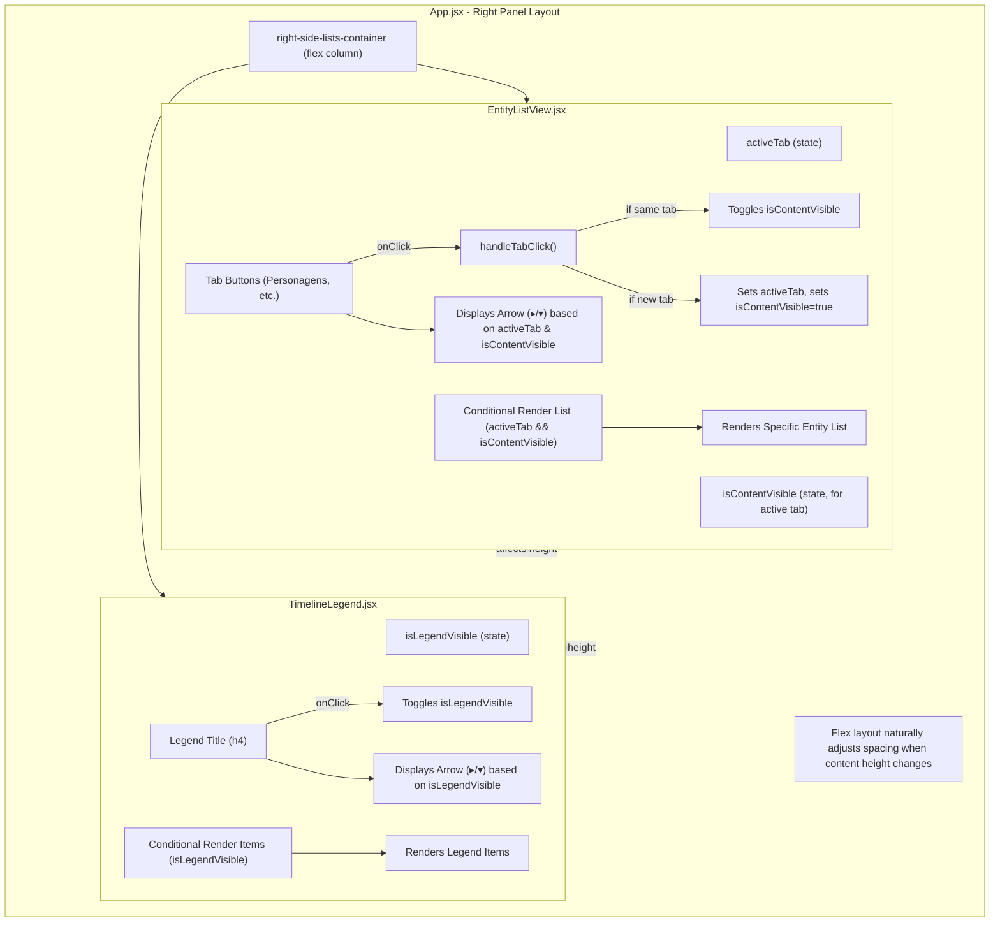

# Plan for Collapsible UI Sections

## I. Core Goals:

1.  **Collapsible Active Tab in `EntityListView`:**
    *   Maintain existing tab behavior (one entity list visible at a time).
    *   The content of the *currently active* tab will be collapsible by clicking its button/title again.
    *   Arrow icons (▸/▾) will indicate the collapsible state next to tab buttons.
2.  **Collapsible `TimelineLegend`:**
    *   The "Legenda de Temas" title will be clickable to toggle the visibility of the legend's content.
    *   An arrow icon (▸/▾) will indicate the state next to the legend title.
3.  **Layout Adjustment:** When a section collapses, elements below it will shift up due to the parent flex layout.

## II. Affected Components and Files:

*   **[`EntityListView.jsx`](Sistema-de-Auxilio-ao-Estudo-Historico-SAEH/src/components/EntityListView.jsx:1):** To manage the collapsed state of the active tab's content and display arrow icons.
*   **[`TimelineLegend.jsx`](Sistema-de-Auxilio-ao-Estudo-Historico-SAEH/src/components/TimelineLegend.jsx:1):** To manage its own collapsed state and display an arrow icon.
*   **[`App.css`](Sistema-de-Auxilio-ao-Estudo-Historico-SAEH/src/App.css:1) (optional):** For minor styling of arrow icons if needed.

## III. Detailed Plan:

### A. `EntityListView.jsx` Modifications:

1.  **State for Active Tab Content Visibility:**
    *   Add: `const [isContentVisible, setIsContentVisible] = useState(true);`
2.  **Modify Tab Button `onClick` Handler:**
    *   When a tab button is clicked:
        *   If it's the current `activeTab`: `setIsContentVisible(!isContentVisible);`
        *   If it's a new tab: `setActiveTab('new_tab_name'); setIsContentVisible(true);`
3.  **Arrow Icons on Tab Buttons:**
    *   Prepend `activeTab === 'tab_name' ? (isContentVisible ? '▾ ' : '▸ ') : '▸ '` to button text.
4.  **Conditional Rendering of List Content:**
    *   Render list using `activeTab === 'tab_name' && isContentVisible && renderList(...)`.

### B. `TimelineLegend.jsx` Modifications:

1.  **Import `useState`:**
    *   `import React, { useState } from 'react';`
2.  **State for Legend Content Visibility:**
    *   Add: `const [isLegendVisible, setIsLegendVisible] = useState(true);`
3.  **Make Title Clickable & Add Arrow:**
    *   Wrap `<h4>` title in a `div` with `onClick={() => setIsLegendVisible(!isLegendVisible)}` and `style={{ cursor: 'pointer', display: 'flex', alignItems: 'center' }}`.
    *   Modify `h4` text: `{isLegendVisible ? '▾' : '▸'} Legenda de Temas`.
4.  **Conditional Rendering of Legend Items:**
    *   Wrap the legend items mapping with `{isLegendVisible && ( ... )}`.

### C. Styling (Optional):

*   Minor CSS for arrow icon alignment or appearance if necessary.
*   Ensure clickable titles have `cursor: pointer;`.

## IV. Workflow Summary & Mermaid Diagram:

## V. Key Considerations:

*   State for collapsed sections will be managed locally within respective components.
*   Arrow icons will improve UX by indicating collapsibility.