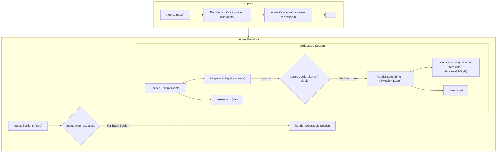

# Plan for Comprehensive Legend System

## I. Core Goal:

*   Create a new, comprehensive legend panel that replaces or enhances the current `TimelineLegend`.
*   This panel will feature multiple, individually collapsible sections, each with its own title, explaining different visual encodings.
*   It will detail:
    1.  Map Point Fill Color (theme-based, with default)
    2.  Map Point Border Color (date-relation based)
    3.  Timeline Point (Circle) Border Color (theme-based, with default)
    4.  Timeline Point (Circle) Fill Color (fixed white)
    5.  Timeline Bar (Rectangle) Color (theme-based, with default)

## II. Data Structure for Legend (`legendConfiguration`):

*   To be defined in `App.jsx` or a dedicated configuration file.
    ```javascript
    // Example structure:
    const legendConfiguration = [
      {
        id: 'mapFill',
        title: 'Mapa: Cor de Preenchimento do Ponto',
        items: [ /* Dynamically from themes + default */ ]
      },
      {
        id: 'mapBorder',
        title: 'Mapa: Cor da Borda do Ponto',
        items: [
          { color: '#FF0000', label: 'Evento Anterior à Data de Referência' },
          { color: '#0000FF', label: 'Evento Posterior à Data de Referência' },
          { color: '#FFFFFF', label: 'Evento na Data de Referência', swatchStyle: { backgroundColor: '#FFFFFF', border: '1px solid #ccc' } }
        ]
      },
      {
        id: 'timelinePointBorder',
        title: 'Linha do Tempo: Cor da Borda do Ponto (Evento Único)',
        items: [ /* Dynamically from themes + default */ ]
      },
      {
        id: 'timelinePointFill',
        title: 'Linha do Tempo: Cor de Preenchimento do Ponto (Evento Único)',
        items: [
          { color: 'white', label: 'Preenchimento Padrão', swatchStyle: { backgroundColor: 'white', border: '1px solid #ccc' } }
        ]
      },
      {
        id: 'timelineBarFill',
        title: 'Linha do Tempo: Cor da Barra (Período)',
        items: [ /* Dynamically from themes + default */ ]
      }
    ];
    // Each item: { color: 'hex', label: 'desc', swatchStyle?: {} }
    ```

## III. New Component (`LegendPanel.jsx`):

1.  **Props:**
    *   `legendSections`: An array following the `legendConfiguration` structure.
2.  **Functionality:**
    *   Iterate `legendSections`. For each section:
        *   Render a clickable title (with ▸/▾ icon) to toggle visibility of its items (using local state for each section's visibility).
        *   If visible, iterate `section.items`, displaying a color swatch (styled with `item.color` and `item.swatchStyle`) and `item.label`.
3.  **Styling:** Panel, sections, titles, and items will need clear styling.

## IV. Modifications in `App.jsx`:

1.  **State/Memoization for `legendConfiguration`:**
    *   Construct `legendConfiguration`, likely using `useMemo` to update based on `themes`.
2.  **Replace `TimelineLegend`:**
    *   Remove `<TimelineLegend ... />`.
    *   Add `<LegendPanel legendSections={legendConfiguration} />` (likely in `right-side-lists-container`).

## V. Workflow Summary & Mermaid Diagram:



## VI. Key Considerations:

*   **Component Reusability:** `LegendPanel.jsx` will be designed for broader use.
*   **Data Aggregation in `App.jsx`:** Correctly reflecting dynamic theme data and static color definitions.
*   **Clarity:** Labels and visual representation (e.g., white swatch borders) must be clear.
*   **Styling:** Ensure usability and consistency.