# Plan: Map Style Switcher with Dynamic UI Theming

## I. Core Goals:

1.  **Map Style Switcher:** Implement a dropdown in `UIControls.jsx` to select from predefined Mapbox styles (Light, Dark, Streets, Satellite with Streets).
2.  **Dynamic Map Update:** `MapView.jsx` should update the map's visual style when a new selection is made.
3.  **Dynamic UI Theming:** The application's UI (panel backgrounds, text, borders, primary buttons) should subtly adapt to complement the selected map style using CSS Custom Properties (Variables).
4.  **Profile Persistence:** The selected map style URL should be saved and loaded with user profiles.

## II. UI Theme Definitions (Examples):

*   **Base/Light & Streets Styles:**
    *   `--panel-background`: `rgba(255, 255, 255, 0.95)`
    *   `--text-color`: `#333333`
    *   `--border-color`: `#cccccc`
    *   `--button-primary-bg`: `#007bff` (Bootstrap blue, example)
    *   `--button-primary-text`: `#ffffff`
*   **Dark Style:**
    *   `--panel-background`: `#2a2a2a` (Dark Grey)
    *   `--text-color`: `#f0f0f0` (Light Grey)
    *   `--border-color`: `#444444`
    *   `--button-primary-bg`: `#5865f2` (Discord-like purple/blue)
    *   `--button-primary-text`: `#ffffff`
*   **Satellite with Streets Style:**
    *   `--panel-background`: `rgba(245, 245, 245, 0.92)` (Slightly transparent Off-White)
    *   `--text-color`: `#222222` (Darker Text)
    *   `--border-color`: `#dddddd`
    *   `--button-primary-bg`: `#28a745` (Green)
    *   `--button-primary-text`: `#ffffff`

## III. Affected Components and Files:

*   **[`config.js`](Sistema-de-Auxilio-ao-Estudo-Historico-SAEH/src/config.js:1):** Define `AVAILABLE_MAP_STYLES` array, where each object includes `name`, `url`, and an `uiTheme` object (key-value pairs for CSS variables).
*   **[`App.css`](Sistema-de-Auxilio-ao-Estudo-Historico-SAEH/src/App.css:1) (or `index.css`):** Define default values for CSS variables on `:root`. Style components using these variables.
*   **[`App.jsx`](Sistema-de-Auxilio-ao-Estudo-Historico-SAEH/src/App.jsx:1):**
    *   Manage `currentMapStyleUrl` state.
    *   `useEffect` hook to iterate through the `uiTheme` of the selected map style and apply these as CSS variables to `document.documentElement.style`.
    *   Pass necessary props to `UIControls` and `MapView`.
    *   Integrate `currentMapStyleUrl` into profile saving/loading.
*   **[`UIControls.jsx`](Sistema-de-Auxilio-ao-Estudo-Historico-SAEH/src/components/UIControls.jsx:1):** Render the `<select>` dropdown for map style selection.
*   **[`MapView.jsx`](Sistema-de-Auxilio-ao-Estudo-Historico-SAEH/src/components/MapView.jsx:1):** Accept `mapStyleUrl` prop and use `map.setStyle()` on change.
*   **Various UI Components:** Refactor components with hardcoded inline styles (for backgrounds, text colors, borders that should be themeable) to use CSS classes styled with the new CSS variables. This includes `LegendPanel.jsx`, `DateControls.jsx`, `EntityListView.jsx`, `DetailModal.jsx` (modal content area), and parts of `App.jsx` (e.g., panel containers).

## IV. Detailed Implementation Steps:

### A. Configuration (`config.js`)
1.  Define and export `AVAILABLE_MAP_STYLES` with `name`, `url`, and `uiTheme` objects.
2.  Ensure `DEFAULT_MAP_STYLE` aligns with one of these.

### B. CSS Setup (`App.css` or `index.css`)
1.  Define CSS variables on `:root` with default theme values (e.g., for Light style).
    ```css
    :root {
      --panel-background: rgba(255, 255, 255, 0.95);
      --text-color: #333333;
      --border-color: #cccccc;
      --button-primary-bg: #007bff;
      --button-primary-text: #ffffff;
      /* ... any other variables ... */
    }
    ```
2.  **Refactor Components:**
    *   Identify elements in `App.jsx`, `UIControls.jsx`, `LegendPanel.jsx`, `DateControls.jsx`, `EntityListView.jsx`, `DetailModal.jsx` that use inline styles for themeable properties (background, color, border).
    *   Replace these inline styles with CSS classes.
    *   Style these classes in the CSS file using `var(--variable-name)`.

### C. Dynamic Theme Application (`App.jsx`)
1.  Import `DEFAULT_MAP_STYLE`, `AVAILABLE_MAP_STYLES` from `config.js`.
2.  Add state: `const [currentMapStyleUrl, setCurrentMapStyleUrl] = useState(DEFAULT_MAP_STYLE);`
3.  Add `useEffect` to apply theme variables:
    ```javascript
    useEffect(() => {
      const selectedStyleConfig = AVAILABLE_MAP_STYLES.find(s => s.url === currentMapStyleUrl);
      if (selectedStyleConfig && selectedStyleConfig.uiTheme) {
        for (const [key, value] of Object.entries(selectedStyleConfig.uiTheme)) {
          document.documentElement.style.setProperty(key, value);
        }
      }
    }, [currentMapStyleUrl]);
    ```
4.  Pass to `UIControls`: `availableMapStyles={AVAILABLE_MAP_STYLES}`, `currentMapStyleUrl={currentMapStyleUrl}`, `onMapStyleChange={setCurrentMapStyleUrl}`.
5.  Pass to `MapView`: `mapStyleUrl={currentMapStyleUrl}`.
6.  **Profile Management:**
    *   `handleSaveProfile`: Add `currentMapStyleUrl` to `uiSettings`.
    *   `handleLoadProfileFile`: Retrieve and set `currentMapStyleUrl` from profile.

### D. UI Element (`UIControls.jsx`)
1.  Accept props: `availableMapStyles`, `currentMapStyleUrl`, `onMapStyleChange`.
2.  Render a `<select>` dropdown:
    ```html
    <div style={{ marginTop: '15px', borderBottom: '1px solid #eee', paddingBottom: '10px' }}>
      <h4>Estilo do Mapa</h4>
      <label htmlFor="map-style-select">Escolha um estilo: </label>
      <select 
        id="map-style-select" 
        value={currentMapStyleUrl} 
        onChange={(e) => onMapStyleChange(e.target.value)}
      >
        {availableMapStyles.map(style => (
          <option key={style.url} value={style.url}>
            {style.name}
          </option>
        ))}
      </select>
    </div>
    ```

### E. Map Update (`MapView.jsx`)
1.  Accept prop: `mapStyleUrl`.
2.  In map initialization: `style: mapStyleUrl`.
3.  Add `useEffect` to handle changes:
    ```javascript
    useEffect(() => {
      if (mapRef.current && isMapLoaded && mapStyleUrl && mapRef.current.getStyle().url !== mapStyleUrl) {
        mapRef.current.setStyle(mapStyleUrl);
      }
    }, [mapStyleUrl, isMapLoaded]);
    ```

## V. Mermaid Diagram

```mermaid
graph TD
    subgraph Config [config.js]
        Def_MapStyles["AVAILABLE_MAP_STYLES (with uiTheme objects)"]
    end

    subgraph CSS [App.css / index.css]
        CSS_Vars_Defaults["Defines :root CSS Variables (default theme)"]
        CSS_ComponentStyles["Component CSS uses var(--variable-name)"]
    end
    
    subgraph App [App.jsx]
        State_CurrentMapUrl["currentMapStyleUrl (state)"]
        
        Effect_ApplyTheme["useEffect watches currentMapStyleUrl"]
        Effect_ApplyTheme -- Finds matching uiTheme in Config --> JS_SetCSSVars["JS: document.documentElement.style.setProperty()"]
        
        App_UIControls["UIControls props:\n- availableMapStyles\n- currentMapStyleUrl\n- onMapStyleChange={setCurrentMapStyleUrl}"]
        App_MapView["MapView props:\n- mapStyleUrl={State_CurrentMapUrl}"]
        
        ProfileLogic["Profile Save/Load"] -- Handles --> State_CurrentMapUrl
    end
    
    UIControls_Select["UIControls.jsx: <select>"] -- onChange --> App_SetCurrentMapUrl["setCurrentMapStyleUrl"]
    
    MapView_SetStyle["MapView.jsx: map.setStyle()"] -- Triggered by --> App_Prop_MapStyleUrl["mapStyleUrl prop change"]

    JS_SetCSSVars --> CSS_Vars_Runtime["CSS Variables updated at runtime"]
    CSS_Vars_Runtime --> UI_Themed["UI elements update appearance via CSS"]

    Config --> App
    App --> UIControls_Select
    App --> MapView_SetStyle
```


## VI. Key Considerations:
*   **Refactoring Effort:** Moving inline styles to CSS classes using variables will be the most extensive part.
*   **Specificity of CSS Variables:** Ensure variables are applied at a high enough level (e.g., `:root` or main app container) to be inherited correctly.
*   **Map State Preservation:** `map.setStyle()` reloads the map; existing marker logic should handle re-adding them.