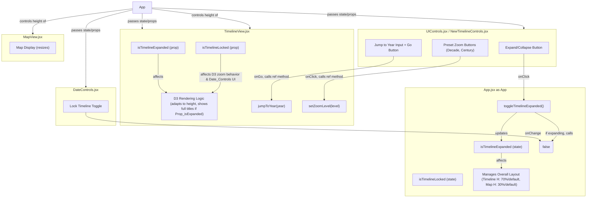

# Plan for Expandable Timeline Feature in SAEH

## I. Core Goal:

*   Modify the timeline to be expandable (occupying 70% of screen height) and collapsible (returning to its original size).
*   When expanded, the timeline will unlock for free navigation, display full event titles, and offer new controls (jump to year, preset zoom levels).
*   The map will resize to accommodate the timeline's changing size.

## II. Affected Components and Files:

*   **[`App.jsx`](Sistema-de-Auxilio-ao-Estudo-Historico-SAEH/src/App.jsx:1)**: For managing the expanded state and overall layout adjustments.
*   **[`TimelineView.jsx`](Sistema-de-Auxilio-ao-Estudo-Historico-SAEH/src/components/TimelineView.jsx:1)**: For rendering changes in expanded mode, displaying more info, and handling new control logic.
*   **[`UIControls.jsx`](Sistema-de-Auxilio-ao-Estudo-Historico-SAEH/src/components/UIControls.jsx:1) (or a new dedicated component)**: To house the expand/collapse button and the new timeline controls.
*   **[`DateControls.jsx`](Sistema-de-Auxilio-ao-Estudo-Historico-SAEH/src/components/DateControls.jsx:1)**: To ensure its `isTimelineLocked` state is correctly updated when the timeline expands.
*   **[`App.css`](Sistema-de-Auxilio-ao-Estudo-Historico-SAEH/src/App.css:1)**: For styling the new layouts and UI elements.

## III. Detailed Plan:

### A. State Management (primarily in [`App.jsx`](Sistema-de-Auxilio-ao-Estudo-Historico-SAEH/src/App.jsx:1))

1.  **`isTimelineExpanded` State:**
    *   Introduce a new state variable: `const [isTimelineExpanded, setIsTimelineExpanded] = useState(false);`
2.  **`toggleTimelineExpanded` Function:**
    *   Create a function: `const toggleTimelineExpanded = () => setIsTimelineExpanded(prev => !prev);`
3.  **Link to `isTimelineLocked`:**
    *   Modify `toggleTimelineExpanded` (or use a `useEffect` hook watching `isTimelineExpanded`): When `isTimelineExpanded` becomes `true`, call the existing function that sets `isTimelineLocked` to `false`. This ensures the timeline unlocks upon expansion.
    *   Pass `isTimelineExpanded` as a prop to child components that need it (e.g., [`TimelineView.jsx`](Sistema-de-Auxilio-ao-Estudo-Historico-SAEH/src/components/TimelineView.jsx:1), [`UIControls.jsx`](Sistema-de-Auxilio-ao-Estudo-Historico-SAEH/src/components/UIControls.jsx:1)).

### B. UI and Layout Changes

1.  **Main Layout Adjustment (in [`App.jsx`](Sistema-de-Auxilio-ao-Estudo-Historico-SAEH/src/App.jsx:1) and styled in [`App.css`](Sistema-de-Auxilio-ao-Estudo-Historico-SAEH/src/App.css:1))**
    *   The main application container (likely a Flexbox or Grid layout) will need to adjust the proportions of the map and timeline areas.
    *   Define CSS classes:
        *   `.timeline-container-collapsed { /* original height */ }`
        *   `.timeline-container-expanded { height: 70vh; /* or 70% of parent */ }`
        *   `.map-container-normal { /* original height */ }`
        *   `.map-container-timeline-expanded { height: 30vh; /* or 30% of parent */ }`
    *   In [`App.jsx`](Sistema-de-Auxilio-ao-Estudo-Historico-SAEH/src/App.jsx:1), conditionally apply these classes to the respective container elements based on the `isTimelineExpanded` state.

2.  **Expand/Collapse Button (in [`UIControls.jsx`](Sistema-de-Auxilio-ao-Estudo-Historico-SAEH/src/components/UIControls.jsx:1) or a new `TimelineControls.jsx`)**
    *   Add a button:
        ```jsx
        <button onClick={toggleTimelineExpanded}>
          {isTimelineExpanded ? 'Collapse Timeline' : 'Expand Timeline'}
        </button>
        ```
    *   This button will receive `toggleTimelineExpanded` and `isTimelineExpanded` as props from [`App.jsx`](Sistema-de-Auxilio-ao-Estudo-Historico-SAEH/src/App.jsx:1).

3.  **New Timeline Controls (conditionally rendered, visible when `isTimelineExpanded` is `true`)**
    *   These controls could reside within the timeline panel itself or alongside the expand/collapse button.
    *   **Jump to Year:**
        *   Input field: `<input type="number" placeholder="Year" id="jumpToYearInput" />`
        *   Button: `<button onClick={handleJumpToYear}>Go</button>`
        *   `handleJumpToYear` will read the input value and call a method on the `timelineViewRef` (see section C.3).
    *   **Preset Zoom Levels:**
        *   Button: `<button onClick={() => handleSetZoomLevel('decade')}>Decade View</button>`
        *   Button: `<button onClick={() => handleSetZoomLevel('century')}>Century View</button>`
        *   `handleSetZoomLevel` will call a method on the `timelineViewRef`.

### C. [`TimelineView.jsx`](Sistema-de-Auxilio-ao-Estudo-Historico-SAEH/src/components/TimelineView.jsx:1) Enhancements

1.  **Props:**
    *   Accept `isTimelineExpanded` as a prop.
2.  **Adapt to Dynamic Height:**
    *   The existing D3 rendering logic uses `svgRef.current.getBoundingClientRect()`, which should automatically pick up height changes when the parent container resizes.
    *   Ensure the `useEffect` hook responsible for D3 rendering has `isTimelineExpanded` (or a dimension prop derived from it) in its dependency array if direct re-rendering logic based on this state is needed beyond just the size change.
3.  **Display Full Event Titles (when `isTimelineExpanded` is `true`)**
    *   Inside the D3 rendering logic (e.g., where `.event-rect` and `.event-circle` are created):
        *   Conditionally append a D3 `text` element if `isTimelineExpanded` is true.
            ```javascript
            // Inside the .each or .join for events
            if (props.isTimelineExpanded) {
              selection.append("text")
                .attr("class", "timeline-event-title-expanded")
                .attr("x", d => /* calculate X position based on event shape */)
                .attr("y", /* calculate Y position */)
                .attr("dy", ".35em") // Vertical alignment
                .style("font-size", "10px") // Adjust as needed
                .style("fill", "#333") // Adjust as needed
                .text(d => d.title)
                .on("click", (event, d) => { if (onEventClick) onEventClick(d.globalId); }); // Keep clickable
            }
            ```
        *   The existing `<title>` element for tooltips should likely remain for both states or be enhanced.
4.  **Implement New Control Functions (exposed via `useImperativeHandle`)**
    *   `jumpToYear(year)`:
        *   Parses the `year`.
        *   Creates a `Date` object (e.g., `new Date(year, 0, 1)` for Jan 1st).
        *   Leverage or adapt the existing `centerOnDate(dateToCenter)` logic to update `xScaleRef.current.domain()` and call `redrawElements()`.
        *   Crucially, update the D3 zoom transform to reflect this programmatic pan/zoom.
    *   `setZoomLevel(level)`:
        *   `level` will be 'decade' or 'century'.
        *   Determine the target timespan in milliseconds.
        *   Get the current center date of `xScaleRef.current.domain()`.
        *   Calculate `newDomainStart` and `newDomainEnd`.
        *   Update `xScaleRef.current.domain([newDomainStart, newDomainEnd])`.
        *   Call `redrawElements()`.
        *   Update the D3 zoom transform.

### D. Styling (in [`App.css`](Sistema-de-Auxilio-ao-Estudo-Historico-SAEH/src/App.css:1) or component-specific files)

1.  Implement the CSS classes for `.timeline-container-collapsed`, `.timeline-container-expanded`, etc.
2.  Style the "Expand/Collapse Timeline" button and the new controls.
3.  Style the `.timeline-event-title-expanded` text elements.

## IV. Workflow Summary & Mermaid Diagram:



## V. Key Considerations:

*   **D3 Zoom Transform Synchronization:** Crucial when programmatically changing the timeline's domain.
*   **Performance:** Monitor performance with full text titles.
*   **CSS Transitions:** Use for smooth height changes.
*   **Responsiveness:** Ensure good behavior on different screen sizes.