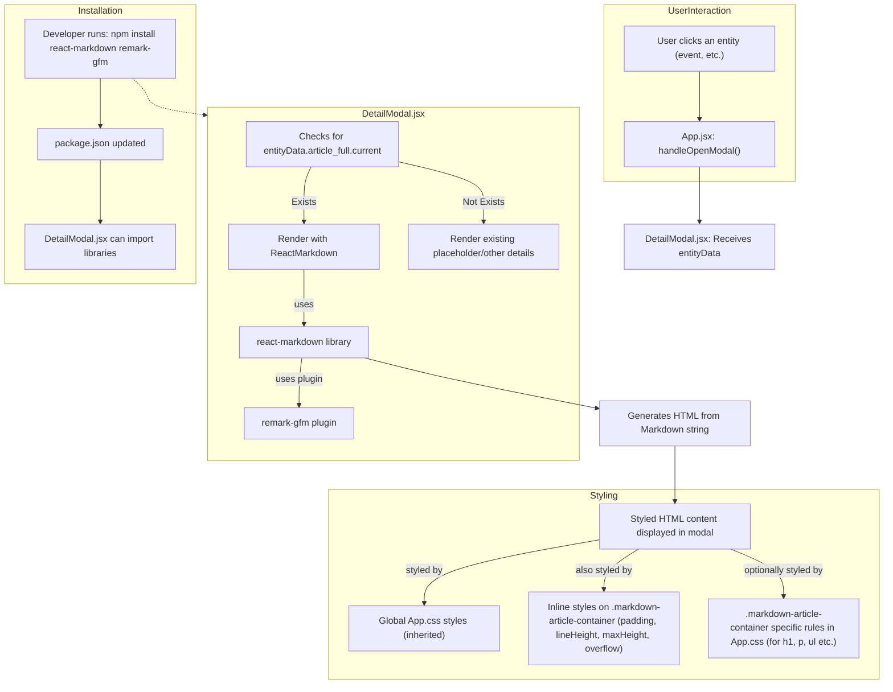

# Plan for Markdown Rendering in DetailModal

## I. Core Goal:

*   Replace the current `<pre>` tag display of `article_full.current` in the `DetailModal` component with a proper Markdown rendering solution.
*   Utilize the `react-markdown` library along with `remark-gfm` to support GitHub Flavored Markdown.
*   Ensure the rendered content inherits global application styles and is displayed within a container that promotes good readability (e.g., appropriate line height, padding, maxHeight with scroll).

## II. Affected Components and Files:

*   **[`DetailModal.jsx`](Sistema-de-Auxilio-ao-Estudo-Historico-SAEH/src/components/DetailModal.jsx:1):** This is where the primary changes will occur to integrate the Markdown renderer.
*   **[`package.json`](Sistema-de-Auxilio-ao-Estudo-Historico-SAEH/package.json:1):** To add `react-markdown` and `remark-gfm` as project dependencies.
*   **[`App.css`](Sistema-de-Auxilio-ao-Estudo-Historico-SAEH/src/App.css:1) (or a component-specific CSS file/style block):** To add styling for the Markdown container to ensure readability if not already covered by global styles.

## III. Detailed Plan:

### A. Install Dependencies:

1.  Add `react-markdown` and `remark-gfm` to the project.
    *   Command: `npm install react-markdown remark-gfm`

### B. Modify [`DetailModal.jsx`](Sistema-de-Auxilio-ao-Estudo-Historico-SAEH/src/components/DetailModal.jsx:1):

1.  **Import necessary components:**
    ```javascript
    import ReactMarkdown from 'react-markdown';
    import remarkGfm from 'remark-gfm';
    ```
2.  **Update `renderEntityDetails` function:**
    *   Replace the `<pre>{entityData.article_full.current}</pre>` tag with:
        ```javascript
        // ... inside renderEntityDetails ...
        if (entityData.article_full && entityData.article_full.current) {
          details = (
            <div>
              {details} {/* Preserves previously assembled details */}
              <h4 style={{ marginTop: '15px' }}>Artigo Completo:</h4>
              <div className="markdown-article-container" style={{ 
                  border: '1px solid #eee', 
                  padding: '10px 15px',
                  maxHeight: '300px', 
                  overflowY: 'auto',
                  lineHeight: '1.6',
                  // maxWidth: '800px', /* Optional: for text flow control */
                  // margin: '0 auto' /* Optional: to center if maxWidth is used */
              }}>
                <ReactMarkdown remarkPlugins={[remarkGfm]}>
                  {entityData.article_full.current}
                </ReactMarkdown>
              </div>
            </div>
          );
        } else if (entityData.description_short === undefined && (!entityData.article_full || !entityData.article_full.current)) {
            details = <div>{details} <p>Ainda sem maiores detalhes.</p></div>;
        }
        // ...
        ```

### C. Styling (in [`App.css`](Sistema-de-Auxilio-ao-Estudo-Historico-SAEH/src/App.css:1) or component-specific CSS):

1.  (Optional) Add specific CSS rules for `.markdown-article-container` and its child elements if more styling control is needed beyond inherited global styles and the inline styles on the container. Example:
    ```css
    .markdown-article-container h1 { font-size: 1.5em; /* ... */ }
    .markdown-article-container p { margin-bottom: 0.8em; }
    ```

## IV. Workflow Summary & Mermaid Diagram:



## V. Key Considerations:

*   **Security:** `react-markdown` provides sanitization.
*   **Styling Conflicts:** Use `.markdown-article-container` for scoping if needed.
*   **Performance:** Generally good, `maxHeight` helps with large content.